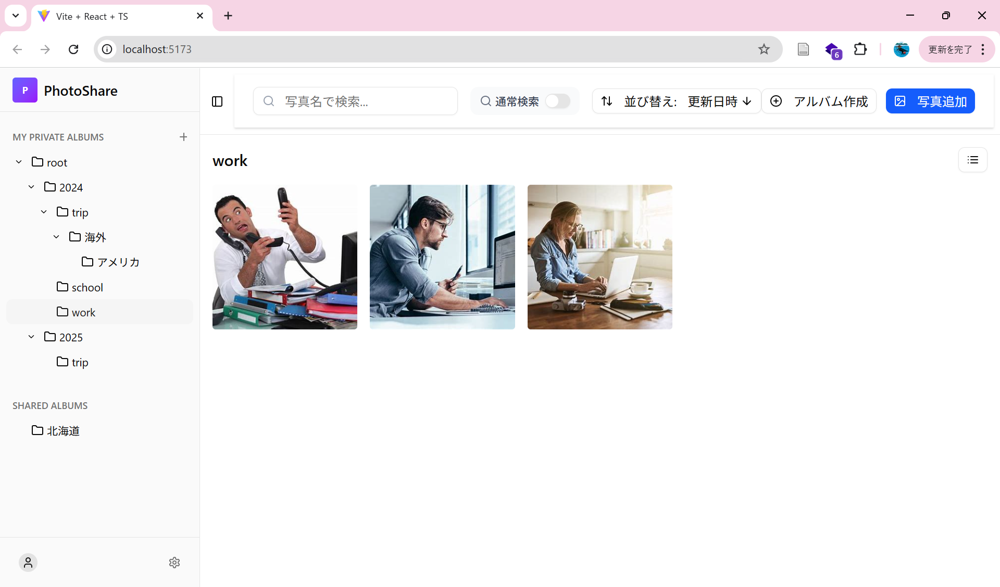
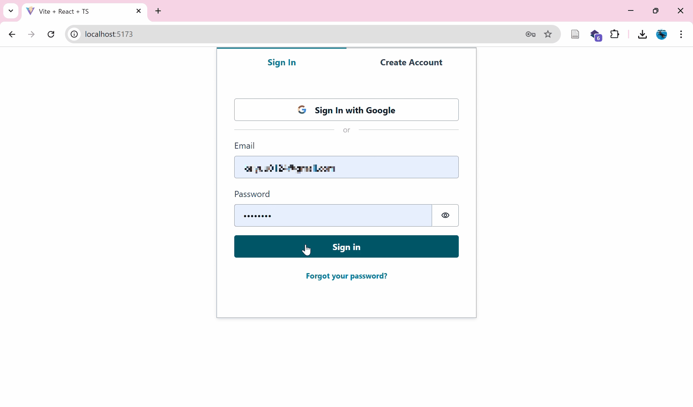
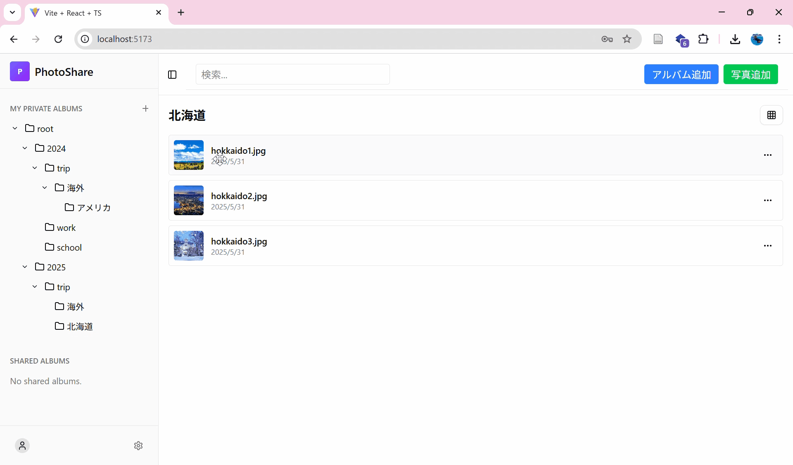
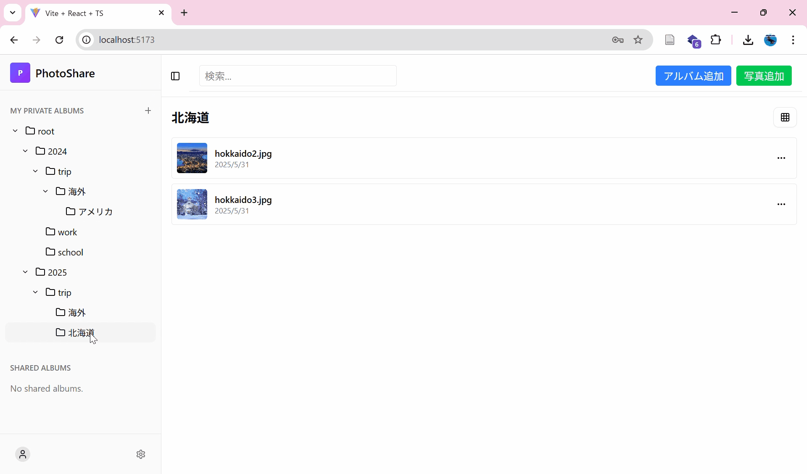
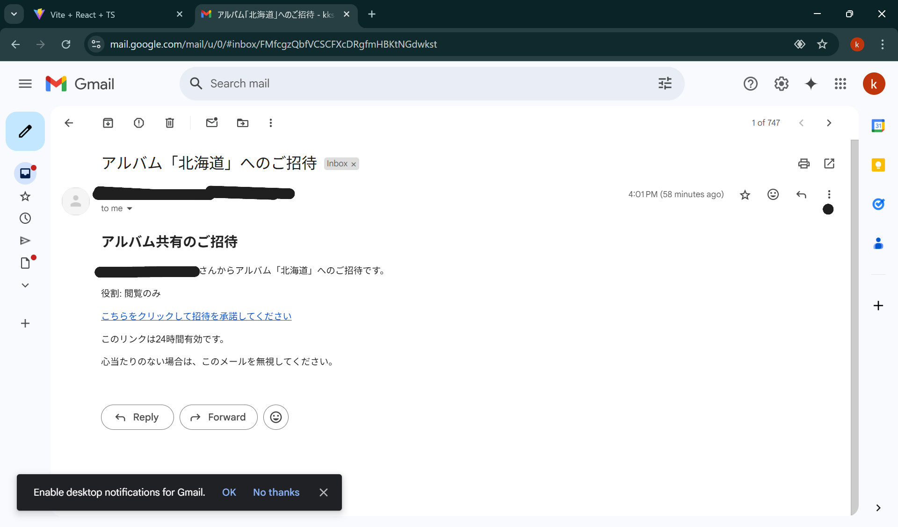
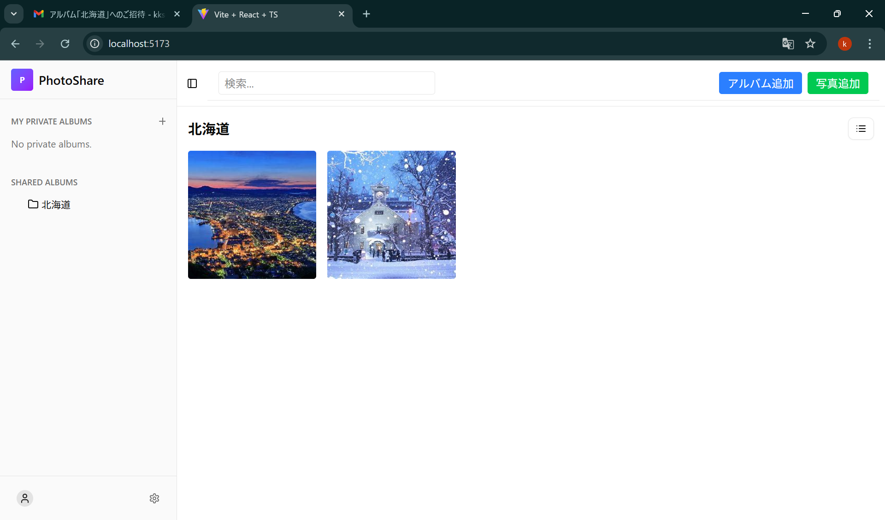

# PhotoShareアプリケーション
---
## 目次

* [概要](#概要)
* [主な特徴](#主な特徴)
* [現状のステータス](#現状のステータス)
  * [実装済み機能](#実装済み機能)
  * [開発中の機能](#開発中の機能)
  * [将来的な拡張機能](#将来的な拡張機能)
* [技術スタック](#技術スタック)
* [デモ](#デモ)
---
## 概要

PhotoShareは、**階層構造で写真を整理し、家族や友人と安全に共有できることを目指したウェブアプリケーション**です。
個人の写真管理はもちろん、プロジェクトやイベントごとの写真共有にも活用できます。

**このプロジェクトは現在も開発が進行中です。**
**MVP開発が完了し、基本的な写真・アルバム管理機能が利用可能です。**

---

## 主な特徴

* **直感的な階層構造**: ファイルエクスプローラーのようにアルバムを階層で管理でき、写真を直感的に整理できます。
* **セキュアなユーザー認証**: AWS Cognitoを利用した堅牢なユーザー認証システムを導入しています。
* **クラウドベースの画像ストレージ**: アップロードされた写真はAWS S3に安全に保存されます。
* **柔軟なアクセス権管理**: アルバムごとにユーザーの権限（オーナー、編集者、閲覧者）を設定できます。
* **便利な検索機能**: ベクトル検索による直感的な検索が可能です。また、ローカルのLLMを用いて画像処理を行っているのでよりセキュアなAI体験を提供しています。
---
## 現状のステータス

### 実装済み機能
* **ユーザー認証**:
    * メールアドレスとパスワードによる新規登録・ログイン・ログアウト (AWS Cognito)
    * 認証トークン (JWT) によるAPI保護
* **アルバム管理**:
    * 階層構造でのアルバム作成 (CRUD: 作成・読み取り・更新・削除)
    * アルバムの移動
* **写真管理**:
    * 写真のアップロード・一覧表示・拡大表示・削除 (CRUD)
    * S3への画像保存と署名付きURLによるサムネイル表示
    * 写真の移動（移動先となるアルバムの強調）
    * グリッドモードと詳細表示モード
* **検索機能・ソート機能**:
    * キーワード検索機能
    * ベクトル検索機能（英語の自然文をベクトル化するので、英語で検索をかけるほうが精度は高い）
    * ソート機能(名前、更新日時)
* **共有機能**:
    * ユーザー招待によるアルバム共有
    * アクセス権限管理 (オーナー / 編集者 / 閲覧者)
    * メール招待連携 (AWS SES)
    * 共有アルバムで写真のアップロード

### 開発中の機能
* **共有機能**:
    * 共有アルバムにアルバム追加
    * 共有アルバム削除など各種メニュー機能

* **検索機能**:
    * アルバムツリーで一括検索をかけられる機能
    * ベクトル検索時のみバックエンドを通すのでクエリ変更ごとに検索するのではなく、Enterや検索ボタン押下で検索
    * ベクトル化における、バックグラウンド処理の進行状況と結果の通知

### 将来的な拡張機能
* サイドバーアルバムに格納している写真数表示機能
* アルバム移動先強調表示機能
* 複数写真移動機能
* 写真メタ情報作成・表示機能
* アルバム階層構造ダウンロード機能
* 写真・アルバム修復機能（ソフトデリートのため修復可能）
* アップロード時重複写真却下提案機能（コサイン類似度がある閾値以上で重複と見なす）
* アップロード時自動フォルダ階層提案機能
---
## 技術スタック

### フロントエンド
* React (Vite)
* TypeScript
* Tailwind CSS
* shadcn/ui

### バックエンド
* Node.js
* Express
* TypeScript
* Prisma (ORM)
* Bullmq
* Ollama(llava:13b)

### データベース
* PostgreSQL (ローカル開発環境 / 本番環境ではAWS RDSを想定)
* Redis(マルチプロセス用インメモリで特にベクトル検索用に使用)

### クラウドインフラ (AWS)
* **Amazon S3**: 画像保存
* **Amazon Cognito**: ユーザー認証・認可
* **Amazon SES**: メール招待機能
* **Amazon EC2**: アプリケーションデプロイ (Dockerベース) (予定)
* **Amazon RDS**: PostgreSQLデータベース (本番環境) (予定)

### その他
* Docker / Docker Compose (開発・デプロイ環境)
* ESLint, Prettier (コード品質)
---
### デモ
* ログイン

* 写真移動

* 写真拡大表示、消去

* 招待

* 招待メール

* 招待されたユーザ画面

* ベクトル検索
